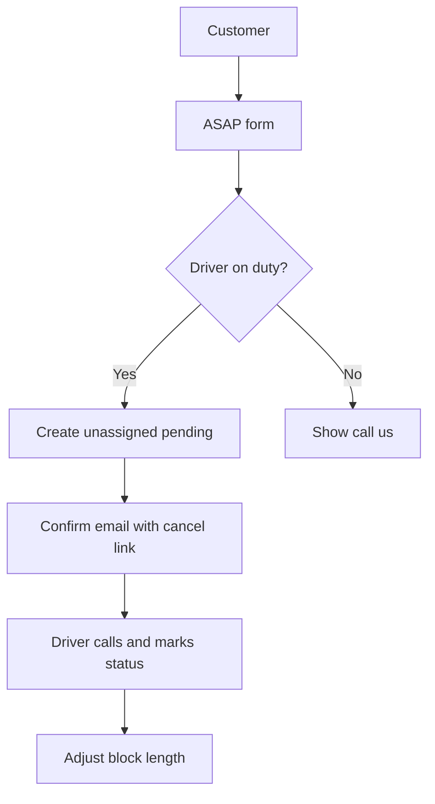

# Bob-n-Pam Drive — Implementation Plan

| | |
|---|---|
| **Purpose** | How to build the product: stack, routes, data, logic, and verification |
| **Companion doc** | [PLAN.md](./PLAN.md) — product requirements and UX rules |
| **Last updated** | 2026-09-16 |

## Changelog

- **2026-09-16** — After a power-loss reboot, **BnPDrive** starts 3 minutes
  after boot with no Windows logon; **BnPDriveWatch** checks
  `http://127.0.0.1:3100` at 6 minutes, at logon, and every 5 minutes, and
  restarts the origin if it is not HTTP 200. Typical public recovery is about
  3–8 minutes after Windows is up (PLAN-driven).
- **2026-09-15** — Driver name filters only apply when at least one `{name}'s
  Rides` box is checked; both off lists all drivers for the active status
  filters (PLAN-driven).
- **2026-09-15** — Driver Rides default filters leave Bob and Pam unchecked;
  assigned rides stay hidden until that driver’s box is checked (PLAN-driven).
- **2026-09-15** — Driver Rides default filters leave Bob unchecked and check
  other drivers (PLAN-driven).
- **2026-09-15** — Customer ASAP submit label is “Click here to request your
  ride”. ASAP `driver_id` may be null; board shows Unassigned and lists those
  rides for every driver filter (PLAN-driven).
- **2026-09-15** — Customer page no longer substitutes default ASAP / hint /
  footer copy when Settings stores an empty string; those notices are omitted
  when blank (PLAN-driven).
- **2026-09-15** — `getSettings()` keeps empty strings (does not substitute
  defaults). Customer banner omits subtitle when blank (PLAN-driven).
- **2026-09-14** — Settings reads use POST; Save succeeds only when the
  server echo matches; a verified save is not replaced when reopening the
  tab (PLAN-driven).
- **2026-09-14** — Settings form ignores GET while the tab is open after Save;
  PUT does not replace the form with a cached response (PLAN-driven).
- **2026-09-14** — Driver board auto-refresh no longer reloads Settings; PUT
  `/api/driver/settings` re-reads SQLite after write so Save cannot be
  overwritten by a stale GET (PLAN-driven).
- **2026-09-14** — Driver `PATCH /api/driver/bookings/[id]` can update ride
  details (not only status/payment). Customer `/` and `/api/slots` refresh
  Settings on load; auto-refresh runs immediately (PLAN-driven).
- **2026-09-14** — Publish must kill leftover `next start` on 3100; Stop-ScheduledTask
  alone can leave the old process running (IMPLEMENTATION-driven).
- **2026-09-14** — Bookings store `airlineName`, `flightNumberFrom`,
  `flightNumberTo`; customer form + driver Rides + emails (PLAN-driven).
- **2026-09-14** — ASAP panel omits the “we’ll call as soon as we can”
  subtitle (PLAN-driven).
- **2026-09-14** — ASAP panel title is “Please enter your ride details”
  (PLAN-driven).
- **2026-09-14** — `SHOW_CUSTOMER_SLOT_BOOKING` hides the customer calendar and
  mode buttons; `/` defaults to the ASAP form. ASAP copy no longer tells
  customers to pick a slot (PLAN-driven).
- **2026-09-12** — Favicon: `public/bobnpam-favicon.svg` via root layout
  `metadata.icons` (PLAN-driven).
- **2026-09-10** — Driver Rides Add Ride: `POST /api/driver/bookings`,
  `validateDriverBookingInput`, open-slot picker, confirmed status, no
  customer email when the ride has no email (PLAN-driven).
- **2026-09-09** — This host runs production `next start` on port 3100 via
  Windows scheduled task `BnPDrive` (startup; agent asks before redeploy)
  (IMPLEMENTATION-driven).
- **2026-09-04** — Apple Maps uses official `source` + `destination` (no GPS);
  To drop-off is pickup → drop-off (PLAN-driven).
- **2026-09-04** — Apple Maps links use `/directions` with `origin` +
  `destination`; GPS when allowed (PLAN-driven).
- **2026-09-04** — Customer booking: structured pickup/drop-off + Census
  geocoder verify via `lib/address.ts` (PLAN-driven).
- **2026-09-04** — Driver Rides: `RideMapsLinks` opens Apple Maps
  (`daddr` + `dirflg=d`) for pickup and drop-off (PLAN-driven).
- **2026-09-03** — Monthly rides: `getMonthlyRidesAndDestinations`, `/api/driver/reports/monthly-rides`, report UI (PLAN-driven).
- **2026-09-03** — Fares by Month: `getFaresByMonth`, `/api/driver/reports/fares-by-month`, ReportToolbar + CSV/print (PLAN-driven).
- **2026-09-03** — Reports tab: `.report-menu` with Fares by Month and Monthly rides placeholders (PLAN-driven).
- **2026-09-03** — Driver board Reports tab between Hours and Settings; placeholder panel (PLAN-driven).
- **2026-09-03** — Hold hours UI commented out on ride rows; Confirm no longer overwrites `holdEndAt` (PLAN-driven).
- **2026-09-03** — Ride actions 2x2 grid; `HoldHoursField` under payment; `.container--driver` 1400px (PLAN-driven).
- **2026-09-03** — `.money-fields`: labels Charged/Received; `$` prefix; fixed 5.5rem inputs; nowrap row; `.money-save` 40px (PLAN-driven).
- **2026-09-03** — `.money-fields` uses flex: nowrap labels, wider inputs, `.money-save` same height as inputs (PLAN-driven).
- **2026-09-03** — Confirmed booking rows use `.ride-row--confirmed` / `.ride-card.confirmed` light-green styling (PLAN-driven).
- **2026-09-03** — Customer receives email on ride confirmed or declined by driver (PLAN-driven).
- **2026-09-03** — Email templates table: added Ride confirmed and Ride declined rows (IMPLEMENTATION-driven).
- **2026-09-02** — MobileSlotAgenda on customer page; explicit viewport; responsive CSS for driver ride cards (PLAN-driven).
- **2026-09-02** — Pending booking rows use `.ride-row--pending` / `.ride-card.pending` light-red styling (PLAN-driven).
- **2026-09-02** — Driver Rides tab datagrid: sort When/Customer/Trip/Status; filter done (off) and confirmed (on) (PLAN-driven).
- **2026-09-02** — Driver board skips settings/hours reload during auto-refresh while those forms are being edited (PLAN-driven).
- **2026-09-02** — Customer `/` server-renders settings + slots; client polling no longer clears settings on failed fetch (PLAN-driven).
- **2026-09-02** — Settings `calendarEventColor`; week grid slot buttons use CSS vars on `WeekCalendar` (PLAN-driven).
- **2026-09-02** — Settings store customer message copy + `messageBackgroundColor`; `CustomerNotice` component on customer/cancel pages (PLAN-driven).
- **2026-09-02** — `WeekCalendar` renders month/year label above day headers; spans two months when the 7-day window crosses a boundary (PLAN-driven).
- **2026-09-02** — `useAutoRefresh` hook polls APIs every 15s when tab visible; customer `/api/slots`, driver `/api/driver/*` (PLAN-driven).
- **2026-09-02** — Slot UI groups by start time; multiple drivers at the same time show separate pick buttons (PLAN-driven).
- **2026-09-02** — Customer page: booking panel slides in beside calendar (desktop) or above (mobile) on slot select (PLAN-driven).
- **2026-09-02** — Local dev uses port **3001** (3000 often occupied by unrelated tools like WrenAI).
- **2026-09-02** — Built v1 app: Next.js 15, SQLite, all routes and responsive UI (IMPLEMENTATION-driven).
- **2026-09-02** — Initial implementation spec aligned with PLAN.md (PLAN-driven).

---

## Stack

| Layer | Choice | Notes |
|-------|--------|-------|
| Framework | **Next.js** (App Router) + TypeScript | Single deployable app |
| Database | **SQLite** | File-based; easy backup; sufficient for two drivers |
| Auth | **Session cookie** | Shared driver password; hash stored in env, not in git |
| Email | **Resend** (optional) or console log in dev | Confirm/cancel link + ASAP alert templates |
| Styling | **CSS** (responsive, phone-first) | No heavy UI kit required |

### Code style

- 2-space indentation
- Single quotes
- Semicolons required
- Max line length: 100 characters

### Static assets

| File | URL | Used by |
|------|-----|---------|
| `public/bobnpam-favicon.svg` | `/bobnpam-favicon.svg` | Root layout `metadata.icons` (browser tab) |

## Routes

| Route | Access | Purpose |
|-------|--------|---------|
| `/` | Public | Customer page: banner + ASAP booking form (calendar and mode buttons hidden) |
| `/book/cancel/[token]` | Public (token) | Customer change/cancel via email link |
| `/driver` | Password | Driver board: Rides, Fares, Hours, Reports, Settings |

### Driver board tabs

1. **Rides** — datagrid with sortable When/Customer/Trip/Status; Show Pending / Done / Confirmed / Declined / No-Show filters; `{name}'s Rides` (Bob and Pam off; both off does not hide assigned rides); **Add Ride** after those checkboxes (visible with an empty list); **Edit** under Status; rows show email, flight fields, passengers, notes; payment fields; 2x2 status actions (Confirm/Done, No-show/Decline); Apple Maps **To pickup** (`destination` only) / **To drop-off** (`source` = pickup, `destination` = drop-off); `PATCH /api/driver/bookings/[id]` updates status, payment, or full ride details
2. **Fares** — per-driver completed-ride money totals
3. **Hours** — per-driver weekly schedule + day-off exceptions
4. **Reports** — horizontal submenu: **Fares by Month**; **Monthly rides and destinations** (API + table + CSV/print)
5. **Settings** — business name, banner color, calendar slot color, booking-window days, customer message copy, message highlight color

## Reports

| Report | Route / data | Notes |
|--------|--------------|-------|
| Fares by Month | `GET /api/driver/reports/fares-by-month?from=&to=` via `getFaresByMonth` | Done rides with money; group by month + driver; shared `ReportToolbar`; CSV export; print CSS |
| Monthly rides and destinations | `GET /api/driver/reports/monthly-rides?from=&to=` via `getMonthlyRidesAndDestinations` | Done/confirmed/no-show trip log; pickup & drop-off; month totals; CSV/print |

## Data model (conceptual)

### `drivers`

| Field | Type | Notes |
|-------|------|-------|
| id | PK | |
| firstName | string | Shown on calendar slots (e.g. Bob, Pam) |
| phone | string | Optional; for driver contact |

### `availability`

| Field | Type | Notes |
|-------|------|-------|
| id | PK | |
| driverId | FK | |
| dayOfWeek | int | 0–6 |
| startTime | time | |
| endTime | time | |

### `availability_exceptions`

| Field | Type | Notes |
|-------|------|-------|
| id | PK | |
| driverId | FK | |
| date | date | Day off or override |
| startTime | time | Nullable = full day off |
| endTime | time | |

### `bookings`

| Field | Type | Notes |
|-------|------|-------|
| id | PK | |
| driverId | FK, nullable | Assigned driver; null until the board picks one (ASAP) |
| status | enum | `pending`, `confirmed`, `done`, `no_show`, `cancelled`, `declined` |
| bookingType | enum | `slot`, `asap` |
| tripType | enum | `airport`, `medical`, `school`, `other` |
| startAt | datetime | Slot start or ASAP request time |
| holdEndAt | datetime | End of calendar block (default by trip type; driver-adjustable) |
| customerName | string | |
| customerPhone | string | |
| customerEmail | string | |
| airlineName | string | Optional; empty when not given |
| flightNumberFrom | string | Optional inbound flight number |
| flightNumberTo | string | Optional outbound flight number |
| pickupAddress | string | Formatted `street, city, ST ZIP` (verified or confirmed anyway) |
| dropoffAddress | string | Formatted `street, city, ST ZIP` (verified or confirmed anyway) |
| passengerCount | int | |
| notes | string | Optional |
| amountCharged | REAL | Agreed fare (nullable) |
| amountReceived | REAL | Cash received incl. tips (nullable) |
| cancelToken | string | Unique; for email change/cancel link |
| createdAt | datetime | |
| updatedAt | datetime | |

### `settings`

| Field | Type | Default | Notes |
|-------|------|---------|-------|
| businessName | string | Bob-n-Pam Drive | Banner text |
| bannerSubtitle | string | (may be empty) | Subtitle under banner; omitted on customer page when blank |
| bannerColor | string | sky blue hex | Configurable |
| bookingWindowDays | int | 14 | How far ahead slots show |
| calendarEventColor | string | `#1a73e8` | Open slot buttons on customer week grid |
| messageBackgroundColor | string | `#FFF4CC` | Highlight behind customer notices |
| messageBookingSuccess | string | (default) | After successful booking |
| messageAsapInfo | string | (may be empty) | ASAP explanation; omitted on customer page when blank |
| messageBookingHint | string | (may be empty) | Calendar hint before slot pick; omitted when blank |
| messageFooterNote | string | (may be empty) | Footer payment note; omitted when blank |
| messageSlotUnavailable | string | (default) | Selected slot taken |
| messageSelectSlot | string | (default) | Validation: pick a slot |
| messageAsapNoDriver | string | (default) | ASAP API: no driver on duty |
| messageAsapNoSlot | string | (default) | ASAP API: no open slots |
| messageCancelSuccess | string | (default) | Cancel page confirmation |
| messageChangeByPhone | string | (default) | Cancel page change instructions |

`PUT /api/driver/settings` writes the row, logs `data/settings-last-write.json`,
and returns `getSettings()`. `POST /api/driver/settings` returns the current
row (used instead of GET so the value cannot come from an HTTP GET cache).
Save on the driver board succeeds only when that echo matches the form.
A verified save is kept when leaving and returning to Settings.

## Slot generation

For each day in `[today … today + bookingWindowDays]`:

1. Expand each driver’s **weekly availability** minus **exceptions**
2. Subtract intervals blocked by **pending** and **confirmed** bookings (`startAt` → `holdEndAt`)
3. Emit remaining intervals as **labeled open slots** (driver first name + start time). **Same wall-clock time may appear twice** — once per available driver.
4. Same-day: include **any remaining time** from now onward
5. UI groups slots by `startAt`; when multiple drivers share a time, customer picks **Bob** or **Pam**

### Default hold duration

```text
airport  → startAt + 3 hours
other    → startAt + 1 hour  (medical, school, other)
```

Driver **confirm** action may set `holdEndAt` to a custom value.

### Cancel / release

- Customer cancel (token link) or driver Decline → status `cancelled` / `declined`; remove block
- Unconfirmed bookings **never auto-expire** (per PLAN)

## Address verification

Customer pickup and drop-off are nested `{ street, city, state, zip }` on
`POST /api/bookings`. `validateBookingInput` requires all four (US state +
5-digit or ZIP+4). `verifyUsAddress` in `lib/address.ts` calls the US Census
Bureau geocoder (no API key). A match stores `street, City, ST ZIP` (Census
city/state/ZIP when they differ). No match returns `address_unverified` and
the form offers **Use this address anyway**. Census timeout/HTTP failure
accepts the typed-in full line so bookings still go through.

Driver **Add Ride** (`POST /api/driver/bookings`) uses the same address parts
and Census check. `validateDriverBookingInput` requires name plus From/To;
phone is optional. The ride is `confirmed`, `bookingType: slot`, `tripType:
other`, `passengerCount: 1`, empty email. `startAt` must still be an open slot
for that driver (`isOpenSlot`). No confirmation email is sent.

USPS is not used: it needs a mailing account and is licensed for shipping,
not ride destinations.

## ASAP flow



Customer slot picking is gated by `SHOW_CUSTOMER_SLOT_BOOKING` in
`CustomerBookingPage` (currently `false`). Slot UI and APIs stay in the codebase.

1. Customer submits ASAP form (same fields as slot booking; no slot pick)
2. Create booking with `bookingType: asap`, status `pending`
3. Determine **on-duty drivers** (current time within availability, no exception)
4. If none on duty → return UI message: call us
5. If on duty → create pending ASAP with no `driverId`; both see urgent
   Unassigned on the driver board (no calendar hold until a driver is picked)
6. Send confirmation email + optional ASAP alert email to driver inbox (TBD)

## Email templates

| Template | Trigger | Contents |
|----------|---------|----------|
| Booking confirmation | Slot or ASAP submit | “We’ll call to confirm”; pickup/drop-off; flight info when given; cancel/change link with `cancelToken` |
| Ride confirmed | Driver marks confirmed | Skipped when `customerEmail` is empty (phone-in rides); includes flight info when given |
| Ride declined | Driver marks declined | Skipped when `customerEmail` is empty |
| ASAP alert | ASAP when driver on duty | Urgent summary for driver inbox (optional in v1); includes flight info when given |

## Auth

- `POST /driver/login` — verify password against env hash; set HTTP-only session cookie
- Middleware protects `/driver/*` except login
- Single shared password for Bob and Pam

## Responsive implementation

| Breakpoint | Customer page | Driver board |
|------------|---------------|--------------|
| Mobile | ASAP form (calendar hidden); when `SHOW_CUSTOMER_SLOT_BOOKING` is on: agenda list + form above calendar | Stacked ride cards; large tap targets |
| Desktop (≥768px) | ASAP form (calendar hidden); when flag is on: week grid + sticky side panel | Table or two-column list + detail |

- Test at phone width (~375px) and desktop (~1280px)
- No hover-only interactions
- `tel:` links for tap-to-call on all ride phone numbers
- Apple Maps links on each ride (`RideMapsLinks`): official
  `https://maps.apple.com/directions?source=&destination=&mode=driving`
  (no browser GPS; To drop-off sets `source` to the pickup address)

## Environment variables

| Variable | Purpose |
|----------|---------|
| `SQLITE_PATH` | SQLite file path (default `./data/bnp-drive.db`) |
| `DRIVER_PASSWORD` | Plain-text dev password (default `changeme`) |
| `DRIVER_PASSWORD_HASH` | Bcrypt hash (overrides plain password in production) |
| `SESSION_SECRET` | JWT cookie signing |
| `APP_URL` | Base URL for cancel links in emails |
| `RESEND_API_KEY` | Optional; without it, emails log to console |
| `EMAIL_FROM` | Sender address when using Resend |
| `DRIVER_ALERT_EMAIL` | Optional ASAP alert inbox |

## Windows production host (this machine)

Public URL `https://bobnpamdrive.com` is served by Cloudflared (Windows
service, Automatic) to `http://localhost:3100`. The app is the Windows
scheduled task **BnPDrive** (`next start -p 3100` from `L:\BnPDrive`, SYSTEM,
3 minutes after boot, on AC or battery, **without a Windows logon**). Typical
recovery is about 3–8 minutes after Windows is up. **BnPDriveWatch** runs
`scripts/ensure-production.cmd` 6 minutes after boot, at user logon, and every
5 minutes: if the homepage is not HTTP 200 it ends **BnPDrive**, kills a
leftover listener on 3100, and starts the task again. After application
code changes, ask before rebuilding and restarting **BnPDrive** (see
`.cursor/rules/rebuild-restart-windows-host.mdc`). Do not use SYSTEM
PowerShell for these tasks — it can hang on this host. After `Stop-ScheduledTask`,
kill any process still listening on 3100, then start the task. Do not run
`next dev` on 3100.

## Project structure (planned)

```text
BnPDrive/
  app/
    page.tsx                    # Customer booking (ASAP form)
    driver/page.tsx             # Driver board (Rides, Hours, Settings)
    driver/login/page.tsx
    book/cancel/[token]/page.tsx
    api/slots/route.ts
    api/bookings/route.ts
    api/bookings/cancel/[token]/route.ts
    api/driver/login|logout|bookings|availability|settings/
  components/
    CustomerBookingPage.tsx     # SHOW_CUSTOMER_SLOT_BOOKING hides calendar/buttons
  lib/
    hooks/useAutoRefresh.ts   # 15s polling while tab visible + refresh on focus
    db/index.ts                 # SQLite schema + queries
    slots/                      # Slot generation + ASAP logic
    auth/session.ts             # JWT cookie session
    email/index.ts              # Resend or console fallback
    bookings/validation.ts
    address.ts                  # Census geocoder + street/city/state/ZIP
    init.ts                     # DB seed on first request
  scripts/
    start-next-production.ps1   # unused; SYSTEM powershell hangs on this host
    ensure-production.cmd       # BnPDriveWatch health restart
  data/bnp-drive.db             # Created at runtime (gitignored)
  docs/PLAN.md
  docs/IMPLEMENTATION.md
  middleware.ts                 # Protects /driver and /api/driver/*
```

## Verification checklist

Before marking a feature complete:

- [x] Customer: ASAP form by default; calendar and mode buttons hidden
- [x] Customer: ASAP when driver on duty / not on duty
- [x] Customer: cancel via email token link
- [x] Driver: login, view rides, tap-to-call, change status, adjust duration
- [x] Driver: To pickup / To drop-off open Apple Maps driving directions
- [x] Driver: set weekly hours; slots reflect availability
- [x] Driver: update Settings (name, color, window)
- [x] Customer: pickup/drop-off require street, city, state, ZIP and verify
- [x] Driver: Add Ride popout (name, optional phone, From/To, open slot, driver)
- [x] Held slots disappear from public calendar
- [x] Responsive: phone + desktop layouts
- [ ] Browsers: manual smoke in Chromium (Edge/Chrome), Firefox, Safari

## Future (not v1)

- Google Calendar sync for driver phones
- Maps-based travel-time buffer
- Address autocomplete
- SMS notifications
- Per-driver passwords

---

When architecture or code changes, update this file to match reality, then [PLAN.md](./PLAN.md) if user-visible behavior changed. See `.cursor/rules/keep-docs-updated.mdc`.
